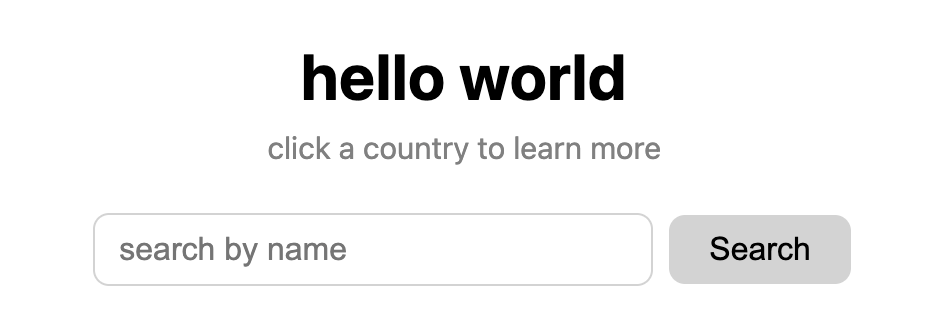
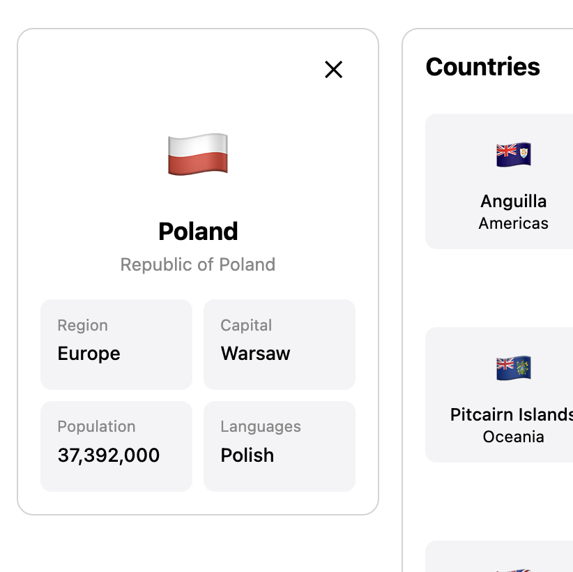

# hello world

**Summary: hello world is an online geography learning tool.**

**Live deployed link:** 

**Coder:**\
Sanaa-Uzuri Robotham

## API:

REST Countries [https://restcountries.com/]

**Endpoints:**

**Collection endpoint:** [https://restcountries.com/v3.1/all?fields=name,flag,cca3,region]

My collection API endpoint provided me with a certain set of fields for each country. I used the following fields from each artwork:

- `name`
- `flag`
- `cca3(country_code)`

**Single item endpoint:** [https://restcountries.com/v3.1/alpha/${code}?fields=name,flag,capital,region,population,languages]

My single item API endpoint provided me with data for just one country. I used the following fields from the artwork:

- `${code} === cca3(country_code)`
- `name`
- `flag`
- `capitol`
- `region`
- `population`
- `languages`

## Features

**MVP features:**
- Search for countries by name
- Click a country to see more information about the country

## Setup instructions

```javascript
npm install
npm run dev
```

## Technologies Used
- HTML
- CSS
- JavaScript
- Vite
- Claude.ai

## Usage/Demo

Below is a walkthrough of hello world's core features.

**<details><summary>Search</summary>**



Type in a country name to find a specific country
</details>

**<details><summary>Country Detail Panel</summary>**



Click a country card to open a panel with the country's name, flag, capitol, region, population, and languages
</details>


## Known Limitations and Future Improvements

**Known limitations:**
- N/A

**Future improvements:**
- Addition of a Maps feature allowing users to see a country through Google Maps by clicking a button.